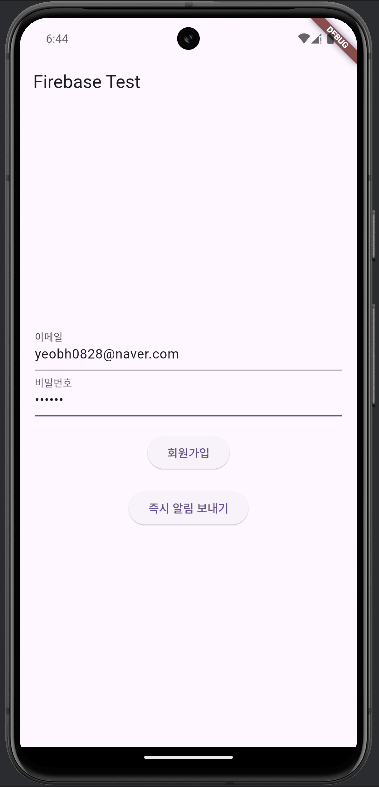
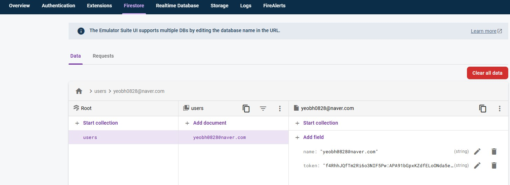
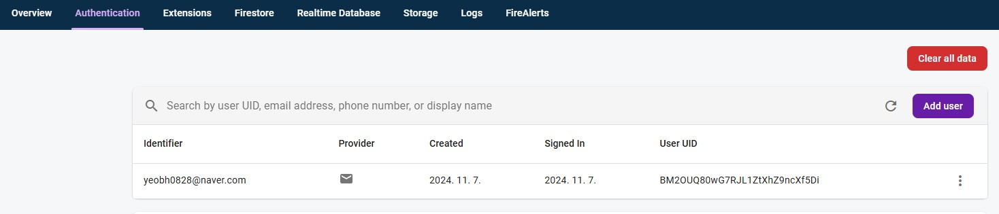

# Firebase Test App

## 소개
이 앱은 Firebase Authentication과 Firebase Cloud Messaging(FCM)을 Flutter 프로젝트에 통합하는 방법을 보여줍니다. 사용자가 회원가입을 완료하면 환영 알림 메시지가 전송됩니다. Firebase Functions를 사용하여 사용자가 생성될 때 FCM 메시지가 트리거되도록 구현되었습니다.

## 주요 기능
- Firebase Authentication을 사용한 사용자 등록.
- Firebase Cloud Messaging(FCM)을 통해 푸시 알림 전송.
- 백그라운드에서도 알림을 받을 수 있도록 `flutter_local_notifications` 사용.
- `permission_handler` 패키지를 이용한 권한 관리.
- 사용자 생성을 위한 기본 HTTP 요청 처리(`http` 패키지 사용).

## 앱에서 사용한 패키지 

* firebase_core: ^3.6.0
* flutter_local_notifications: ^18.0.0
* firebase_messaging: ^15.1.3
* permission_handler: ^11.3.1
* http: ^1.2.2


## 완성 이미지 


